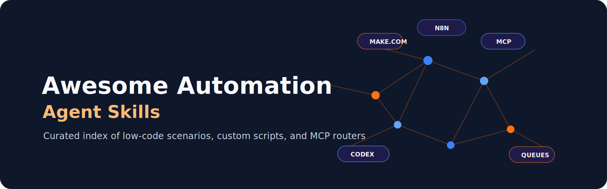

  

<h1 align="center">Awesome Automation Agent Skills</h1>

  <strong>A curated index of agent-ready automation patterns, skills, and tool-selection doctrine for Make.com, n8n, MCP, Codex automations, SaaS connectors, and multi-agent queues.</strong>

  
  

  <a href="#start-here">Start Here</a> ·
  <a href="#core-categories">Categories</a> ·
  <a href="#public-boundary">Public Boundary</a>

This repo is public-safe by design. It links to reusable patterns and mock templates, not live workflows or private operational data.

## Start Here

- [Selection Matrix](docs/selection-matrix.md)
- [Public Safety Rules](docs/public-safety.md)
- [Workflow Card Template](templates/workflow-card.md)
- [starlight-automation-agent-skills](https://github.com/frankxai/starlight-automation-agent-skills) — installable Codex skills and public-safe Starlight automation doctrine.
- [workflow-tier-plugin](https://github.com/frankxai/workflow-tier-plugin) — 8 portable, ready-to-run multi-agent Claude Code workflows.
- [Automation Operating Guide](https://github.com/frankxai/starlight-automation-agent-skills/blob/main/docs/automation-operating-guide.md)

## Core Categories

### Tool Routers

- Automation tool router skills that decide when to use native connectors,
  Codex automations, MCP, Make.com, n8n, or a swarm queue.

### Make.com

- Scenario maps for low-code SaaS glue.
- On-demand scenario patterns for MCP exposure.
- Lead intake, purchase follow-up, and approval workflow sketches.

### n8n

- Workflow JSON review patterns.
- Self-hosted and private-data workflow guidance.
- Public template skeletons with credentials removed.

### MCP

- Typed tool boundary checklists.
- Scope and auth review patterns.
- Make MCP and n8n MCP exposure notes.

### Codex Automations

- Recurring repo health checks.
- Inbox and calendar briefings.
- Deployment and PR monitors.

### Swarm Queues

- Multi-agent handoff formats.
- Bounded worker-lane templates.
- Evaluation and synthesis gates.

### Operations And Evals

- Decision records for why a workflow belongs in Make, n8n, MCP, Codex, Hermes, or a queue.
- Cost reviews for credits, executions, model usage, hosting, and maintenance time.
- Weekly failure reviews, monthly ownership audits, and quarterly migration/delete decisions.

## Public Boundary

Do publish:

- generic workflow maps
- mock payloads
- screenshots with no private data
- validation scripts
- installable public-safe skills

Do not publish:

- credentials
- live webhook URLs
- customer data
- inbox or calendar contents
- private memory
- revenue or partner pipeline details

## First Companion Repo

- `frankxai/starlight-automation-agent-skills` for installable Codex skills and
  public-safe Starlight automation doctrine.
